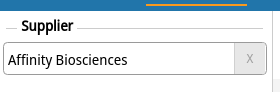

# Research for SEO optimization - [bioseek.eu](https://www.bioseek.eu/us/eng/research/home)
Brieff description or some grphics


# `SEO can't work over night`
Some general information over the SEO process and the way the user interacts with the internet
 * 60/40 mobile/desktop ratio CTR(click through rates)
 * Organic clicks are major part of user action (Organic clicks are clicks on regular google search results that appear right after the sponsored results or imidiately if you have add block xD)

## `Table of Content:`
1. [Keywords, meta tags and keywords](#1-keywords-meta-tag-and-actual-keywords-in-google-analytics)
2. [Overall Structure & HTML Structure](#2-overall-structure-&-html-structure)
3. [Sitemaps]
4. [Structured markup]
5. [Profiling and suggestions for optimising BioSeek]
6. [Tools]

## `Terms`
* SERP: search engine result page

# `1. Keywords, meta tags and keywords`

Aim for words that might hit people needs: "diseases", "genes", "drugs", "pathways". "Search", "free", "efficient" are too vague and can mean anything.
Keywords that match the domain name and content at the same time: "biotech", "biological". It's good if keyword appears in the subdomain or in the extension/suffix of the domain name.
Keyword appearing in the text and the number of times it reappears affects indexing and ranking. [Source](https://ai.googleblog.com/2014/08/teaching-machines-to-read-between-lines.html)
* LSI Keywords
    * Title and Description Tags
    * In the conten --- Headings paragraphs etc
* Google keyword planner!!

### Meta tags:

* Title: Must include keywords BUT must also match the content of the page as much as posible.
    * Title Tag Starts with Keyword: According to [Moz](https://moz.com/) ,title tags that starts with a keyword tend to perform better than title tags with the keyword towards the end of the tag.
    * Title visibility is based on pixel width not character count. It's recommended to not exceed 70 symbols but if all the chars are wide as much as W letter for example, the title will be trimmed way before this 70 limit.
    * !!! AVOID duplicate titles !!!
    * Unless home ot about page the brand names in title should be positioned at the end.

* Description 
    * Brief and acurate description that my vary. It's not necessary the description to be the abstract of the article. It can be the headline, keywords from the headline, date of publication, publisher and authors. This allows programmaticaly generated descriptions.
    * The description may appear in the SERP snippet but not necessary. Google search algorithms deside if the description in the SERP snippet will be the description from the meta element or description extracted form the content of the webpage. All this depends on the search query aswell.

* Keywords meta tag: (keywords pointed in meta tag don't play key role in google ranking anymore)
    * No more than 10 words per page
    * Words should be separated by comas, e.g: content="example,another example"


### AdWords Keywords:
* There is paid service for trargeting specific keywords. That doesn't mean that your ranking will improve significantly. 


## URL structure
* Urls should contain only words
* These words should be descriptive, related to the content, easy to comprehend and a FEW (ass less as posible)
* Avoid using too many subdirectories
* Avoid long urls: urls length is up in the list of [ranking factors](https://backlinko.com/google-ranking-factors)
* folder structure over hyphens: 

Examples: 
* NCBI: 
```
https://example.com/products/pants/redlongpants
https://www.ncbi.nlm.nih.gov/search/all/?term=chromosome
https://www.ncbi.nlm.nih.gov/search/all/?term=nfkb1
https://www.ncbi.nlm.nih.gov/gene/?term=nfkb1
```


## Images
* Images should be with descriptive, content related name of the file, same with the alt attribute, should have caption text(this will be hard for science diagrams and drawings)
* Should be hosted on the same domain !!! NCBI pictures should be uploaded to the bioseek servers
* Images should be in different format than .jpg --> !!!! what formats?? how to convert them???

## Headings
* One H1 per page.
* H1 tags are a “second title tag”. Along with your title tag, Google uses your H1 tag as a secondary relevancy signal

## Links
* Anchor tags names should match the destination of the link.
## Response codes
* Response codes should be ONLY 200, 301, 404

## Not Found Page
* Should be consistent with the website design and provides easy way to return back or navigate to another part of the website
* Bio seek not found page can include the header and the search bar similar to github notfound page

## Feature snippets:
* Featured snippets are special boxes where the format of regular listings is reversed, showing the descriptive snippet first.
* How can I mark my page as a featured snippet?
You can't. Google systems determine whether a page would make a good featured snippet for a user's search request, and if so, elevates it.
* Types of snippets:
    * Paragraph snippets ---> bioseek may qualify for those
    * List snippets
    * Table snippets
* Tools: [Snippet Optimizer](https://seomofo.com/snippet-optimizer.html)
* More info: [Google](https://support.google.com/websearch/answer/9351707), [Google](https://support.google.com/webmasters/answer/35624), [SEO Mofo](https://seomofo.com/general/featured-snippet-guide-google/)

## `Structured Markup`

* [Schema](schema.org), [DCMI](https://www.dublincore.org/)
* The schemas are a set of 'types', each associated with a set of properties. The types are arranged in a hierarchy.
The core vocabulary currently consists of 614 Types, 902 Properties, and 114 Enumeration values.

* Provides search services: type "search action". We can add the search action semantics on each page that returns search result. Properties needed: query

```html
    <script type="application/ld+json">
    {
        "@context": "http://schema.org",
        "@type": "WebSite",
        "url": "http://example.com/",
        "potentialAction": {
            "@type": "SearchAction",
            "target": "http://example.com/search?&q={query}",
            "query": "required"
        }
    }
    </script>
```
* Provides scientific article references and information.

### Description of the pages:
* Home Page

* Search result page:
    * Headline
    * Author or authors
        * name
        * link
    * Publisher
        * date published
    * ISSN
    * Pubmed reference
    * DOI
    * Abstract
    * Images?
        * props of image
    * Links to other sources (PubMed, Wikipedia, Google Scholar etc.)
    * Have analytics and citation graphics
    * Citations - the citations are another articles that have: 
        * Headline
        * Publisher
        * Abstract
        * Posible Image
        * Authors

* Author Page
    * Name
    * External links -> Wikipedia, Google Scholar
    * Analytics --- some graphics
    * Publications of the same author [many]: Type: article
        * Headline
        * Publisher
            * Organization
            * Date published
        * Abstract
        * Images?
        * Authors:
            * Name


* Type "Article"

    * about: The subject matter of the content.
    * abstract
    * author: Organization or person
        * Person
            * person props 
    * Citation: A citation or reference to another creative work, such as another publication, web page, scholarly article, etc
    * copyrightHolder
    * datePublished
    * headline: Headline of the article


Actual structure:

```json
{
    "author": {
        "@type": "Person",
        "name": "{$_authors_name_$}"
    }
}
```


Example of an article scheme in livescience.com:

```json
{
    "@type": "NewsArticle",
    "name": "Deforestation: Facts, Causes & Effects",
    "headline": "Deforestation: Facts, Causes & Effects",
    "alternativeHeadline": "Reference Article: Facts about deforestation. ",
    "articleBody": "Deforestation is the permanent removal of trees to make room for something besides forest. This can include clearing the land for agriculture or grazing, or using the timber for fuel, construction or manufacturing.&nbsp; Forests cover more than 30% of the Earth&apos;s land surface, according to the World Wildlife Fund . These forested areas can provide food, medicine and fuel for more than a billion people. Worldwide, forests provide 13.4 million people with jobs in the forest sector, and another&hellip;",
    "datePublished": "2019-11-06T20:47:37Z",
    "image": "https://cdn.mos.cms.futurecdn.net/WVMczmo522VVf5XLsEavaW.jpg",
    "author": {
        "@type": "Person",
        "name": "Sarah Derouin"
    },
    "creator": {
        "@type": "Person",
        "name": "Sarah Derouin"
    },
    "publisher": {
        "@type": "Organization",
        "name": "Live Science",
        "url": "https://www.livescience.com",
        "logo": {
            "@type": "ImageObject",
            "url": "https://vanilla.futurecdn.net/livescience/media/img/ls-logo-inverted.svg",
            "caption": "Live Science logo"
        }
    },
    "mainEntityOfPage": {
        "@type": "WebPage",
        "@id": "https://www.livescience.com/27692-deforestation.html"
    },
    "url": "https://www.livescience.com/27692-deforestation.html",
    "thumbnailUrl": "https://cdn.mos.cms.futurecdn.net/WVMczmo522VVf5XLsEavaW-320-80.jpg",
    "articleSection": "Deforestation",
    "keywords": [
        "Category: Deforestation",
        "deforestation facts",
        "effects of deforestation",
        "causes of deforestation",
        "deforestation",
        "what is deforestation",
        "type_news",
        "channel_other",
        "serversidehawk",
        "videoarticle"
    ],
    "@context": "http://schema.org"
}
```
## `Profiling and suggestions for optimising BioSeek`

### Main goals, purposes of the website:
* Who are we targeting? Who should use and reach out for the website?
* What people are searching for that bioseek can give them as information? If we unify data from platforms like NCBI, UniProt etc. then the data should be genes, proteins, deseases etc. or what else? How to synthesize this in keywords, phrases (long tail keywords, mid tail keywords)
* What is the content? (besides home page) [articles, authors, producst, all related to BIOlogical DATA]
* What can users ultimately do with the website's content?
* How to include the marktetplace as part of the website presentation?
* Suggestions: genes, proteins, diseases, medications, clinical trials, research, publications, bio-products, lab equipment

These questions should help with defining good keywords.

### Things to update:
* Title
    * The title element should have more meaningful name on search pages. 
        ```
        NCBI title -> Search: {search query} - NCBI
        Google title -> {search query} - Google search
        Consider adding key words for the home page title aswell for the other pages
        ```
    * The authors pages have no meaningful titles
* Find a way to generate meaningful keywords. Should be separated by commas. If possible different than the headline.
    * The author pages ---> fix the titles and the description meta tag 
    * Suggestion for author description is number of publications, citations, university field of research etc.
    * the title and the description snippet should differentiate
* Canonical link element:
    ```html
    <link rel="canonical" href="https://example.com/dresses/green-dresses" />   
    ```

* URLs

    * BioSeek:
        ```
        https://www.bioseek.eu/us/eng/research/search?q=nfkb1
        ```


differences like sorting or filtering does not make those pages unique


### Sitemaps:

* Figure out how to structure the sitemaps. So far we have sitemap files for the marketplace section of the website BUT I should make a graphic representic the structure of the website. Main sections and how are they conected to each other.
* Need cannonical pages. Pages that slightly variates existing page should not be indexed


#### Types assosiated with bioseek content:
* 

#### How to write the semantics?:
* Microdata -  attributes in the markup
* JSON-LD - JSON-like description of the semantics


## `Tools`
* https://search.google.com/structured-data/testing-tool/u/0/ move this
* [Google Search Console](https://search.google.com/search-console/about)
* [Snippet Optimizer](https://seomofo.com/snippet-optimizer.html)
* [Wordstream Kewords](https://www.wordstream.com/keywords)
* You can check out statistics about keywords in [google trends](https://trends.google.com/trends/?geo=US)


### Suggestions for the UI and UX for the website:

* The constat popping up login/register form is action blocking and intrusive. Suggestion: Pop up as call to action that leads to the register/login page. The popup/toaster should appear at the edge of the screen and should not block interaction with the website. OR clicking outside the dialog should hide it.
* Remove particleJS. It's generic. Half/All of the newly formed websites/projects use it in this form or another. 2nd it bloats the performance. The CPU usage is 100% all the time (this is the most obvious reason but it could be something else)
* Demo and Beta badges in the header should be the same size and shape (color aswell maybe) 
* Why the scholar nav link in the header is green while the others are black? (because it's the active tab but this is so unclear, the active item should be more clear that is active)
* bug with the header: cant be accessed on pages with short content like here: https://www.bioseek.eu/us/eng/research/search?q=24132122&p=1&ps=10&x=0&tp=9&s=0&rp=info&rps=0&rpa=ARTICLE%3APUBMED%3A24132122&rpt=93dcsssca , maybe needs throtling
* Marketplace, manufacturer, company tag looks like input field. (needs restyling) 
