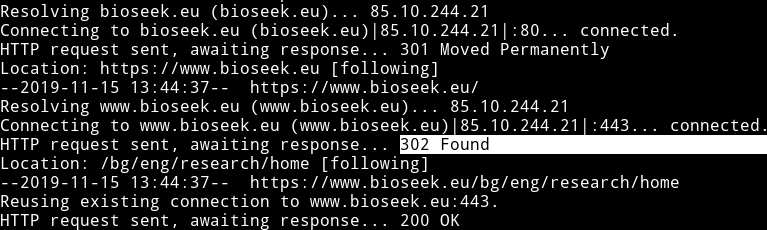

# Research for SEO optimization - [bioseek.eu](https://www.bioseek.eu/us/eng/research/home)

SEO stands not only for optimizing your website for search engines but improving it over time in all aspects. Each optimization no matter how small leads to better user experience thus to more popularity and visits.

On-site SEO - is the practice of optimizing elements on a website 
Off-site SEO - optimizing backlinks or other "external signals"

Google statistics:
* 40% of the searches on google lead to clicking a SERP
* 60% of those clicks come form mobile devices and 40% from desktop
* Major part of those clics are organic clicks
* Organic clicks are clicks on regular google search results that appear right after the sponsored results or imidiately if you have add block xD

## Table of Content:
1. [Keywords, meta tags and keywords](#1-keywords,-meta-tags-and-keywords)
2. [Overall Structure & HTML Structure](#2-overall-structure-&-html-structure)
3. [Sitemaps](#3-sitemaps)
4. [Structured markup](#4-structured-markup)
5. [Non-google search engines](#5-non-google-search-engines)
6. [Suggestions for optimizing BioSeek](#6-suggestions-for-optimizing-bioseek)
7. [Tools](#7-tools)

## `Terms`
* SERP: search engine result page

# `1. Keywords, meta tags and keywords`

## 1.1 Keywords

Aim for words that might hit people needs: "diseases", "genes", "drugs", "pathways". "Search", "free", "efficient" are too vague and can mean anything if not related to more specific keywords.
<br/>

Keywords that match the domain name and content at the same time: "biotech", "biological". 
<br/>

It's good if keyword appears in the subdomain or in the extension/suffix of the domain name.
<br/>

Keyword appearing in the text and the number of times it reappears affects indexing and ranking. [Source](https://ai.googleblog.com/2014/08/teaching-machines-to-read-between-lines.html)
<br/>

LSI Keywords

## 1.2 Meta tags:

### Title
```html
<title>BioSeek</title>
```

 Must include keywords BUT must also match the content of the page as much as posible.
* Title Tag Starts with Keyword: According to [Moz](https://moz.com/) ,title tags that starts with a keyword tend to perform better than title tags with the keyword towards the end of the tag.
* Title visibility is based on pixel width not character count. It's recommended to not exceed 70 symbols but if all the chars are wide as much as W letter for example, the title will be trimmed way before this 70 limit.
* !!! AVOID duplicate titles !!!
* Unless home ot about page the brand names in title should be positioned at the end.

### Description 

```html
    <meta name="description" content="Your gorgeous description">
```

* Brief and acurate description that my vary. It's not necessary the description to be the abstract of the article. It can be the headline, keywords from the headline, date of publication, publisher and authors. This allows programmaticaly generated descriptions.
* The description may appear in the SERP snippet but not necessary. Google search algorithms deside if the description in the SERP snippet will be the description from the meta element or description extracted form the content of the webpage. All this depends on the search query aswell.
* Maximum length allowed for the description is 300 rows. 

### Keywords meta tag

```html
<meta name="keywords" content="HTML, CSS, XML, XHTML, JavaScript">
```

* Keywords pointed in meta tag don't play key role in google ranking anymore.
* No more than 10 words per page
* Words should be separated by comas, e.g: content="example,another example"

## 1.3 Open Graph -- [link](https://ogp.me/)

## 1.4 AdWords Keywords:
* There is paid service for trargeting specific keywords. That doesn't mean that your ranking will improve significantly. 

# `2. Overall Structure & HTML Structure`

## 2.1 URL structure
* URls with non-ascii chars should be UTF-8 encoded and properly escaped [source](https://webmasters.googleblog.com/2010/03/working-with-multilingual-websites.html)
* URL domain name and extension (google doesn't consider eu extension as local)
* URLs should contain only words
* These words should be descriptive, related to the content, easy to comprehend and a FEW (ass less as posible)
* Avoid using too many subdirectories
* Avoid long urls: urls length is up in the list of [ranking factors](https://backlinko.com/google-ranking-factors)
* Folder structure over hyphens: `/` over `:`

### Examples:
```
https://example.com/products/pants/redlongpants
https://www.ncbi.nlm.nih.gov/search/all/?term=chromosome
https://www.ncbi.nlm.nih.gov/search/all/?term=nfkb1
https://www.ncbi.nlm.nih.gov/gene/?term=nfkb1
```


## 2.2 Images
* Images should be with descriptive, content related name of the file, same with the alt attribute. Should have caption text(this will be hard for science diagrams and drawings)
* Should be hosted on the same domain.
* Image formats like JPEG 2000, JPEG XR, and WebP often provide better compression than PNG or JPEG, which means faster downloads and less data consumption. [source](https://developers.google.com/web/tools/lighthouse/audits/webp?utm_source=lighthouse&utm_medium=devtools)
* Not all pages should pass the requirements. Only those that are content-related and meaningful.
* alt attribute description should be no longer than 125 characters

## 2.3 Headings
* One H1 per page.
* H1 tags are a “second title tag”. Along with your title tag, Google uses your H1 tag as a secondary relevancy signal

## 2.4 Links
* Anchor element text content should match the destination of the link.

## 2.5 Response codes
* Response codes should be ONLY 200, 301, 404 ([redirects](https://moz.com/learn/seo/redirection))


## 2.6 Not Found Page
* Should be consistent with the website design and provides easy way to return back or navigate to another part of the website
* Bio seek not found page can include the header and the search bar similar to github notfound page

## 2.7 ???Feature snippets:
* Featured snippets are special boxes where the format of regular listings is reversed, showing the descriptive snippet first.
* How can I mark my page as a featured snippet?
You can't. Google systems determine whether a page would make a good featured snippet for a user's search request, and if so, elevates it.
* Types of snippets:
    * Paragraph snippets ---> bioseek may qualify for those
    * List snippets
    * Table snippets
* Tools: [Snippet Optimizer](https://seomofo.com/snippet-optimizer.html)
* More info: [Google](https://support.google.com/websearch/answer/9351707), [Google](https://support.google.com/webmasters/answer/35624), [SEO Mofo](https://seomofo.com/general/featured-snippet-guide-google/)


# `3. Sitemaps`
# `4. Structured Markup`

* [Schema](schema.org), [DCMI](https://www.dublincore.org/)
* The schemas are a set of 'types', each associated with a set of properties. The types are arranged in a hierarchy.
The core vocabulary currently consists of 614 Types, 902 Properties, and 114 Enumeration values.

* Provides search services: type "search action". We can add the search action semantics on each page that returns search result. Properties needed: query

* Provides scientific article references and information.

### Description of the pages:

#### Description of each page


* Home Page
Website type is used only on home page

```json
    {
        "@context": "http://schema.org",
        "@type": "WebSite",
        "name": "Bioseek",
        "description": "Some description",
        "url": "http://example.com/",
        "potentialAction": {
            "@type": "SearchAction",
            "target": "https://www.nike.com/w?q={search_term_string}&vst={search_term_string}&cp=10730997131_seo_",
            "query-input": "required name=search_term_string"
        }
    }
```

Type organization

```json
    {
        "@context": "http://schema.org",
        "@type": "Organization",
        "name": "Bioseek",
        "url": "https://www.bioseek.eu/",
        "logo": {
            "@type": "ImageObject",
            "url": "https://dy3xjh9gbx10h.cloudfront.net/bioseek/bioseek_logo_og.jpg",
        },
        "contactPoint"      : [{
            "@type"         : "ContactPoint",
            "telephone"     : "(+359 (884) 288-336)",
            "contactType"   : "Customer Service"
        }],
        "sameAs"            :[
            "https://www.facebook.com/bioseek/",
        ],
    }

```


* Search result page:
    * Headline
    * Author or authors
        * name
        * link
    * Publisher
        * date published
    * ISSN
    * Pubmed reference
    * DOI
    * Abstract
    * Images?
        * props of image
    * Links to other sources (PubMed, Wikipedia, Google Scholar etc.)
    * Have analytics and citation graphics
    * Citations - the citations are another articles that have: 
        * Headline
        * Publisher
        * Abstract
        * Posible Image
        * Authors


* Author Page
    * Name
    * External links -> Wikipedia, Google Scholar
    * Analytics --- some graphics
    * Publications of the same author [many]: Type: article
        * Headline
        * Publisher
            * Organization
            * Date published
        * Abstract
        * Images?
        * Authors:
            * Name


* Type "Article"

    * about: The subject matter of the content.
    * abstract
    * author: Organization or person
        * Person
            * person props 
    * Citation: A citation or reference to another creative work, such as another publication, web page, scholarly article, etc
    * copyrightHolder
    * datePublished
    * headline: Headline of the article


Actual structure:

```json
{
    "author": {
        "@type": "Person",
        "name": "{$_authors_name_$}"
    }
}
```


Example of an article scheme in livescience.com:

```json
{
    "@type": "NewsArticle",
    "name": "Deforestation: Facts, Causes & Effects",
    "headline": "Deforestation: Facts, Causes & Effects",
    "alternativeHeadline": "Reference Article: Facts about deforestation. ",
    "articleBody": "Deforestation is the permanent removal of trees to make room for something besides forest. This can include clearing the land for agriculture or grazing, or using the timber for fuel, construction or manufacturing.&nbsp; Forests cover more than 30% of the Earth&apos;s land surface, according to the World Wildlife Fund . These forested areas can provide food, medicine and fuel for more than a billion people. Worldwide, forests provide 13.4 million people with jobs in the forest sector, and another&hellip;",
    "datePublished": "2019-11-06T20:47:37Z",
    "image": "https://cdn.mos.cms.futurecdn.net/WVMczmo522VVf5XLsEavaW.jpg",
    "author": {
        "@type": "Person",
        "name": "Sarah Derouin"
    },
    "creator": {
        "@type": "Person",
        "name": "Sarah Derouin"
    },
    "publisher": {
        "@type": "Organization",
        "name": "Live Science",
        "url": "https://www.livescience.com",
        "logo": {
            "@type": "ImageObject",
            "url": "https://vanilla.futurecdn.net/livescience/media/img/ls-logo-inverted.svg",
            "caption": "Live Science logo"
        }
    },
    "mainEntityOfPage": {
        "@type": "WebPage",
        "@id": "https://www.livescience.com/27692-deforestation.html"
    },
    "url": "https://www.livescience.com/27692-deforestation.html",
    "thumbnailUrl": "https://cdn.mos.cms.futurecdn.net/WVMczmo522VVf5XLsEavaW-320-80.jpg",
    "articleSection": "Deforestation",
    "keywords": [
        "Category: Deforestation",
        "deforestation facts",
        "effects of deforestation",
        "causes of deforestation",
        "deforestation",
        "what is deforestation",
        "type_news",
        "channel_other",
        "serversidehawk",
        "videoarticle"
    ],
    "@context": "http://schema.org"
}
```
# `5. Non-google search engines`

## Baidu

Ranking factors: [source](https://www.sekkeistudio.com/blog/baidu-seo-guide-2019/)
* Loading speed 
* Fresh content

# `6. Suggestions for optimizing BioSeek`

### Main goals, purposes of the website:
* Who are we targeting? Who should use and reach out for the website?
* What people are searching for that bioseek can give them as information? If we unify data from platforms like NCBI, UniProt etc. then the data should be genes, proteins, deseases etc. or what else? How to synthesize this in keywords, phrases (long tail keywords, mid tail keywords)
* What is the content? (besides home page) [articles, authors, producst, all related to BIOlogical DATA]
* What can users ultimately do with the website's content?
* How to include the marktetplace as part of the website presentation?
* Suggestions: genes, proteins, diseases, medications, clinical trials, research, publications, bio-products, lab equipment

These questions should help with defining good keywords.

### Things to update:
* Title
    * The title element should have more meaningful name on search pages. 
        ```
        NCBI title -> Search: {search query} - NCBI
        Google title -> {search query} - Google search
        Consider adding key words for the home page title aswell for the other pages
        ```
    * The authors pages have no meaningful titles
    * The coming soon pages have no meaningful titles

* Description:
    * Authors and marketplace pages have the same descriptions taken from the home page.

* Keywords meta tag:
    * Find a way to generate meaningful keywords. Should be separated by commas. If possible different than the headline.
    * Authors and marketplace pages have abstract, and list of products for keywords. Fix the format and the number of keywords.

Suggestion for author title is the name of the author, maybe field of research.
Suggestion for author description is number of publications, citations, university, field of research etc.
Suggestion for marketplace titles
Suggestion for marketplace descriptions

images -  !!! NCBI pictures should be uploaded to the bioseek servers with appropriate format (JPEG 2000, JPEG XR, and WebP)

pdf.js should be minified  
swager jsonlike stuff should be compressed (gzip) -> https://www.bioseek.eu/api/swagger?version=638940014461afc1fd38dfc75487d8c9c890c5c8

consider if there are pages that should not be indexed but kept in the website  
THERE ARE ----> All the coming soon pages should not be indexed. Reason: No content.

use robots meta tag in such situation  
```html
<meta name="robots" content="noindex, nofollow">
```
<br/>


Replace the 302 response code from the redirects with 301 --> [Source](https://moz.com/learn/seo/redirection)
<br/>
<br/>
  
  
Question: Does the language/country feature apply or is it going to apply to the main content and functionality of the website?
If this feature is required only for particular pages/services it should be kept there or show only when you are there. Too much info that is irrelevant to the user experience is better to be not presented. 
If we tend to keep it, this should be specified in the sitemaps.

If webmastered right the result should be displaying the language specific page according to the region where the search had occured.

Add the link rel alternate in the page that redirects to the language version that has been chosen. Add this to bioseek.eu page.
Redirects are encouraged only from the x-default page. Each language specific url should open to the language it is designated to no matter where the link is opened. 
```html
<link rel="alternate" hreflang="x-default" href="https://bioseek.eu"/>
```
> The x-default hreflang link attribute is currently only officially supported by Google and Yandex.

<br/>

* Canonical link element:
    ```html
    <link rel="canonical" href="https://example.com/dresses/green-dresses" />   
    ```
    ```html
    <link rel="canonical" href="https://enhancv.com/" data-baseprotocol="https:" data-basehost="enhancv.com">
    ```

* URLs
    * BioSeek:
        ```
        https://www.bioseek.eu/us/eng/research/search?q=nfkb1
        ```


differences like sorting or filtering does not make those pages unique


### Sitemaps:

* Figure out how to structure the sitemaps. So far we have sitemap files for the marketplace section of the website BUT I should make a graphic representic the structure of the website. Main sections and how are they conected to each other.
* Need cannonical pages. Pages that slightly variates existing page should not be indexed

### Sitelinks
https://support.google.com/webmasters/answer/47334?hl=en
https://bloggingwizard.com/google-sitelinks/

The site structure doesn’t allow algorithms to find good Sitelinks
The Sitelinks aren’t relevant to the user’s query

#### Types assosiated with bioseek content:
* 

#### How to write the semantics?:
* Microdata -  attributes in the markup
* JSON-LD - JSON-like description of the semantics


# `7. Tools`
* https://search.google.com/structured-data/testing-tool/u/0/ move this
* [Google Search Console](https://search.google.com/search-console/about)
* [Snippet Optimizer](https://seomofo.com/snippet-optimizer.html)
* [Wordstream Kewords](https://www.wordstream.com/keywords)
* You can check out statistics about keywords in [google trends](https://trends.google.com/trends/?geo=US)
* Speed test with some tips - [Pingdom](https://tools.pingdom.com/)


### Suggestions for the UI and UX for the website:

* The constat popping up login/register form is action blocking and intrusive. Suggestion: Pop up as call to action that leads to the register/login page. The popup/toaster should appear at the edge of the screen and should not block interaction with the website. OR clicking outside the dialog should hide it atleast.
* Remove particleJS. It's generic. Half/All of the newly formed websites/projects use it in this form or another. 2nd it bloats the performance. The CPU usage is 100% all the time (this is the most obvious reason but it could be something else). Atleast increase the opacity.
* Demo and Beta badges in the header should be the same size and shape (color maybe) 
* Why the scholar nav link in the header is green while the others are black? (because it's the active tab but this is so unclear, the active item should be more clear that is active)
* bug with the header: cant be accessed on pages with short content like here (adjust the screen height to ~ 1000px): [Link](https://www.bioseek.eu/us/eng/research/search?q=24132122&p=1&ps=10&x=0&tp=9&s=0&rp=info&rps=0&rpa=ARTICLE%3APUBMED%3A24132122&rpt=93dcsssca)
* Scroll events, mousemove events, resizing need debouncing and/or throtling
* Marketplace, manufacturer, company tag looks like input field. (needs restyling) 

* Remove the google + option to login. Google + doesn't exist anymore
* Consider breadcrumbs

## [Open graph](https://ogp.me/) --- all of the og meta tags